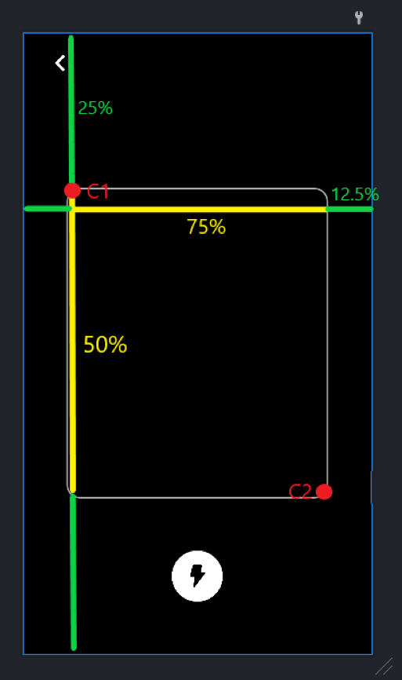

# Barcode-Scanning-with-MLKIT

Showcase of barcode scanning using Google MLKIT and CameraX

## 📕 Dependencies

```kotlin
// View Binding
implementation("com.github.yogacp:android-viewbinding:1.0.3")

// Camera API
implementation("androidx.camera:camera-camera2:1.1.0-alpha10")
implementation("androidx.camera:camera-lifecycle:1.1.0-alpha10")
implementation("androidx.camera:camera-view:1.0.0-alpha30")

// MLKit
implementation("com.google.mlkit:barcode-scanning:17.0.0")
```

Forgive im lazy, so im just shortcut on viewbinding by using this [library](https://github.com/yogacp/android-viewbinding).

## ⚙ Manifest

```kotlin
<uses-permission android:name="android.permission.FLASHLIGHT" />
<uses-permission android:name="android.permission.CAMERA" />
```

</br>

And just copy
- CamActivity
- Image Convertor
- BarcodeAnalyzer

</br>

## 🏃‍♂️ How to start </br>

```kotlin

binding.btnStart.setOnClickListener {
    val i = Intent(this, CamActivity::class.java)
    i.putExtra("title", "Example")
    i.putExtra("msg", "Scan QR code to proceed")
    startActivityForResult(i, REQUEST_CODE)
}

```

How you get your result

```kotlin
override fun onActivityResult(requestCode: Int, resultCode: Int, data: Intent?) {
    super.onActivityResult(requestCode, resultCode, data)
    if (requestCode == REQUEST_CODE && resultCode == Activity.RESULT_OK) {
        val barcode = data?.getStringExtra("BarcodeResult")
        binding.txtResult.text = barcode
    }
}

```

## 📺 Screenshot

 </br>

</br>

## ⚠ About Overlay ⚠

If you planning to scan the barcode inside the box than pay attention on `activity_cam.xml`

```kotlin
    <View
        android:id="@+id/img_qr_box"
        android:layout_width="0dp"
        android:layout_height="0dp"
        app:layout_constraintWidth_percent="0.75"
        app:layout_constraintHeight_percent="0.5"
        android:elevation="5dp"
        android:background="@drawable/scanning_box"
        app:layout_constraintBottom_toBottomOf="parent"
        app:layout_constraintEnd_toEndOf="parent"
        app:layout_constraintStart_toStartOf="parent"
        app:layout_constraintTop_toTopOf="parent" />

```

Instead giving a fix width and height, i use percent for some purpose.
The way i approch is bit dumb but is the most eesy way to do so you can understand more easily (a complex code doesn't show how pro you are.)
</br>

In order to get image inside the box we have to crop it, but how? 
</br>

### 1️⃣ First

Inside `BarcodeAnalyzer` before giving the image to `scanner.process()` the image have to crop.</br>

We getting the height and width of the picture

```kotlin
val height = mediaImage.height
val width = mediaImage.width
```

Than we need a rectangle with two coordinate that point top left and bottom right of the box(overlay). U can refer [this](https://stackoverflow.com/a/26253377) about `Rect()`

```kotlin
//Coordinate 1
val c1x = (width * 0.125).toInt() + 150 //left
val c1y = (height * 0.25).toInt() //top

//Coordinate 2
val c2x = (width * 0.875).toInt() - 150 //right
val c2y = (height * 0.75).toInt() //bottom

//Rectangle
val rect = Rect(c1x, c1y, c2x, c2y)

```

How i calculate?



But sure this method will not always perfect, but it work most of the time i dont give a damn, you can do some minor changes by add/minus value at the back to adjust the rectangle.</br>

### 2️⃣ Second

Thanks [this](https://stackoverflow.com/a/62105972) amazing human, convert ImageProxy to bitmap

```kotlin
val ori: Bitmap = imageProxy.toBitmap()!!
```

So we create a new image which is crop version from the original image

```kotlin
val crop = Bitmap.createBitmap(ori, rect.left, rect.top, rect.width(), rect.height())

val image: InputImage = InputImage.fromBitmap(crop, imageProxy.imageInfo.rotationDegrees)

scanner.process(image)
    .addOnSuccessListener { 
        ...
    }

```

That it.... if u still confuse visit [this](https://github.com/SnorSnor9998/Barcode-Scanning-with-MLKIT/tree/preview).


