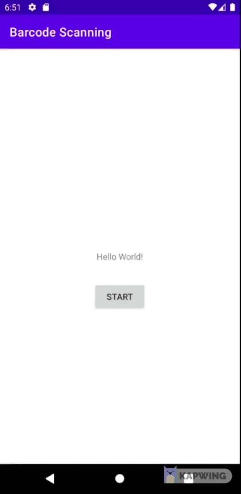

# Barcode-Scanning-with-MLKIT

Showcase of barcode scanning using Google MLKIT and CameraX

## 📕 Dependencies

```kotlin
// View Binding
implementation("com.github.yogacp:android-viewbinding:1.0.4")

// Camera API
implementation("androidx.camera:camera-camera2:1.2.0-beta02")
implementation("androidx.camera:camera-lifecycle:1.2.0-beta02")
implementation("androidx.camera:camera-view:1.2.0-beta02")

// MLKit
implementation("com.google.mlkit:barcode-scanning:17.0.2")
```

Forgive me im lazy, so im just do some shortcut on viewbinding by using this [library](https://github.com/yogacp/android-viewbinding).

## ⚙ Manifest

```xml
<uses-permission android:name="android.permission.FLASHLIGHT" />
<uses-permission android:name="android.permission.CAMERA" />
<uses-feature android:name="android.hardware.camera.any" />
```

</br>

And just copy
- CamActivity
- Image Convertor
- BarcodeAnalyzer

</br>


### ⚠️ ️Update (19/10/2022) ⚠️
There is a bug that will cause a crash when you start the app, apparently the preview is only able to show on Android Emulator but not on a real device.</br>
So if you want adjust the scan box size or customize the box please do it on emulator.</br>
DO NOT PASS THE IMAGE OUT FROM BARCODEANALYZER.</br>
</br>

## 🏃‍♂️ How to start </br>

```kotlin
binding.btnStart.setOnClickListener {
    val i = Intent(this, CamActivity::class.java)
    i.putExtra("title", "Example")
    i.putExtra("msg", "Scan Barcode")
    getContent.launch(i)
}

```

How you get your result

```kotlin
private val getContent =
    registerForActivityResult(ActivityResultContracts.StartActivityForResult()) {
        if (it.resultCode == Activity.RESULT_OK) {
            val barcode = it?.data?.getStringExtra("BarcodeResult")
            
            //In Android Emulator Only
            //val pic = it?.data?.getStringExtra("Image")
            //val image = B64Image.decode(pic.toString())
            //binding.imgResult.setImageBitmap(image)

            binding.txtResult.text = barcode
            

        }
    }

```

## 📺 Screenshot

 </br>

</br>

## ⚠ About Overlay ⚠

If you planning to scan the barcode inside the box than pay attention on `activity_cam.xml`

```xml
    <View
        android:id="@+id/img_qr_box"
        android:layout_width="0dp"
        android:layout_height="0dp"
        app:layout_constraintWidth_percent="0.75"
        app:layout_constraintHeight_percent="0.5"
        android:elevation="5dp"
        android:background="@drawable/scanning_box"
        app:layout_constraintBottom_toBottomOf="parent"
        app:layout_constraintEnd_toEndOf="parent"
        app:layout_constraintStart_toStartOf="parent"
        app:layout_constraintTop_toTopOf="parent" />

```

Instead giving a fix width and height, i use percent for some purpose.
The way i approch is bit dumb but is the most easy way to do so you can understand more easily (a complex code doesn't show how pro you are.)
</br>

In order to get image inside the box we have to crop it, but how? 
</br>

### 1️⃣ First

Inside `BarcodeAnalyzer` before giving the image to `scanner.process()` the image have to be crop.</br>

How i calculate?


But sure this method will not always perfect, but it work most of the time and i dont give a damn, you can do some minor changes by add/minus value at the back to adjust the rectangle.</br>

### ⚠️ ️Update (13/10/2022) ⚠️
I realize the old version that image end up rotate anti-clockwise 90 degree and end up some device had some issue scanning barcode like CODE-128. </br>
So in the end we need to rotate the image 90 degree clockwise before feed to the scanner.


First, getting the height and width of the picture

```kotlin
val height = mediaImage.height
val width = mediaImage.width
```

U can refer [this](https://stackoverflow.com/a/26253377) about `Rect()`

```kotlin
//Since in the end the image will rotate clockwise 90 degree
//left -> top, top -> right, right -> bottom, bottom -> left

//Top    : (far) -value > 0 > +value (closer)
val c1x = (width * 0.125).toInt() + 150
//Right  : (far) -value > 0 > +value (closer)
val c1y = (height * 0.25).toInt() - 25
//Bottom : (closer) -value > 0 > +value (far)
val c2x = (width * 0.875).toInt() - 150
//Left   : (closer) -value > 0 > +value (far)
val c2y = (height * 0.75).toInt() + 25

val rect = Rect(c1x, c1y, c2x, c2y)

```


### 2️⃣ Second

Thanks [this](https://stackoverflow.com/a/62105972) amazing human, convert ImageProxy to bitmap

```kotlin
val ori: Bitmap = imageProxy.toBitmap()!!
```

So we create a new image which is crop version from the original image than we need rotate the image.

```kotlin
val crop = Bitmap.createBitmap(ori, rect.left, rect.top, rect.width(), rect.height())
val rImage = crop.rotate(90F)

val image: InputImage =
    InputImage.fromBitmap(rImage, imageProxy.imageInfo.rotationDegrees)

// Pass image to the scanner and have it do its thing
scanner.process(image)
    .addOnSuccessListener { barcodes ->
        // Task completed successfully
        for (barcode in barcodes) {
            //For Android Emulator Only
            //barcodeListener(barcode.rawValue ?: "", image.bitmapInternal!!)
            barcodeListener(barcode.rawValue ?: "")
            imageProxy.close()
        }
    }
    .addOnFailureListener {
        // You should really do something about Exceptions
        imageProxy.close()
    }
    .addOnCompleteListener {
        // It's important to close the imageProxy
        imageProxy.close()
    }

```
### Snap Snap? The End.....

That all. Happy Coding & keep suffering your life. </br>
### Side note 📝
- if you wonder all those conversions ( `.toBitmap()` & `.rotate()`) will affect the performance don't worry i test on my cheap ass phone (please donate me money) it only take average `0.1 sec` to process.
- And there is some [guidelines](https://developers.google.com/ml-kit/vision/barcode-scanning/android#input-image-guidelines) you can follow and some tips for [performance](https://developers.google.com/ml-kit/vision/barcode-scanning/android#performance-tips) </br>
- `.setTargetResolution` to 1080p for most of the case is really enough epically some high end phone like Samsung S20 it run buttery smooth and fast.
